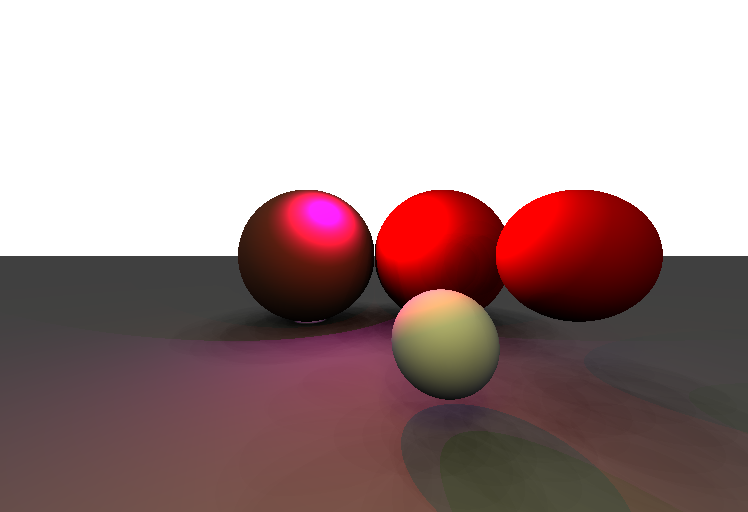
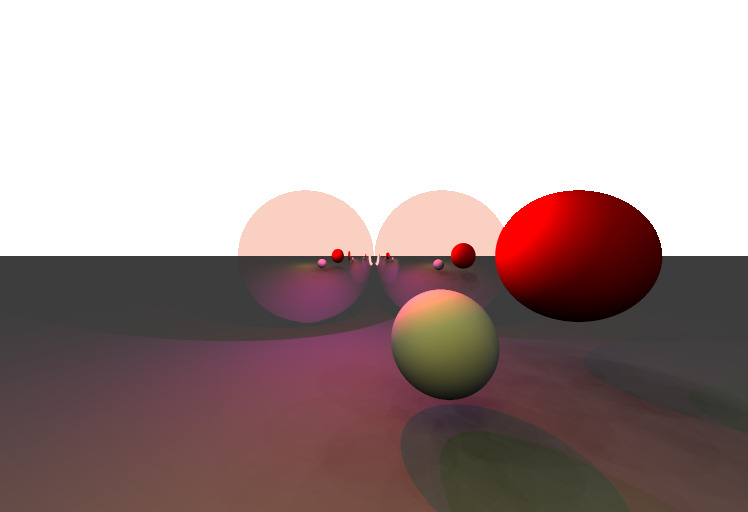

# Projet de synthèse d'image
## Ce qui a été fait
### Fonctionnalités réalisées

- Fonction d'intersection pour tous les objets de la scène (sphere et plan essentiellement) et parcours des pixels avec lancement de rayons.

- Éclairage multi-sources (sources simples, panneau et dôme), géré par plusieurs fonction de calculs de la lumière (fonction éclairage_direct = source et panneau, fonction éclairage_direct_dome pour le dôme). Ces fonctions gère aussi les ombres/la pénombre Les panneaux sont générés par la fonction genere_sources, les dômes par la fonction genere_dome. 

- Anti-aliasing : l'anti-aliasing a été réalisé avec une génération de plusieurs rayons par pixel, comme expliqué dans le cours. Cette partie se situe dans la fonction make_image.

-  Miroir : les objets peuvent être miroir, chaque objet a dans sa structure un booléen qui permet de le considérer comme un miroir ou non, et une couleur de réfraction. (**bonus**) Les miroirs sont aussi récursif, un reflets d'un miroir dans un autre sera calculé jusqu'à ce que la limite de profondeur de récursivité soit dépassée (limite définie à 2 avec la constante MAX_DEPTH, donc un rayon peut rebondir 3 fois maximum). Ces fonctionnalités sont dans les fonctions eclairage_direct et éclairage_direct_dome.

- **Précision sur le fonctionnement du code** : pour le calcul des ombres et des reflets qui necéssitent de renvoyer un rayon depuis l'objet testé et donc de rescanner la scène, nous utilisons une fonction d'intersection auxiliaire à chaque fois (intersect_aux pour eclairage_direct, et intersect_aux_dome pour eclairage_direct_dome). Ceci est fait afin de ne pas faire appel à intersect à nouveau, car on ne veut pas gérer de récursivité ici.

### Liste des bonus réalisées

- bonus 1 : éclairez vos objets avec une ou plusieurs sources de lumière. (tableau de sources dans la scènes).

- bonus 3 : utilisez le panneau comme une source de lumière (cf. au dessus).

- bonus 4 : miroir-miroir ? Miroir récursif, explication dans la section sur les miroirs.

- bonus 7 : une surprise ? Pour nous le bonus 7 est l'éclairage par dome + panneau + source simple.

## Image exemple

- Scène avec un plan, des sphères. Nombre de lumières : dome = 64 et couleur blanche, panneau = 32 et couleur (1,1,0) (jaune), point simple = 2 (1,0,0) (rouge) et (1,0,1) (violet), total = 98.




- Même image avec un anti-aliasing de 10 : 


- Même scène mais les deux sphères du fond sont miroirs : Paramètres des miroirs : couleur de refraction : (0.98, 0.82, 0.76) (refraction cuivre). 



- Même chose avec un anti-aliasing de 10 : 


Ces images sont toutes disponibles en HDR dans le dossier "Image" de l'archive.


## Ce qui marche bien

De notre point de vue, toutes les fonctionnalités (miroirs, différents éclairages, ombres/pénombres) réalisées marchent correctement, et n'occasionnent pas de bug peu importe la disposition des objets etc. Le code fonctionne assez rapidement avec une centaine de lumières et plus.

## Ce qui marche moins bien / ce qu'on aurait aimé faire.

Le seul point que l'on aurait aimé améliorer est peut être l'impression de relief/profondeur de champ. 
Aussi, peut-être encore améliorer la vitesse d'execution pour des images longues à calculer (avec une limite de récursivité plus grande, beaucoup de lumières etc.).

## Retour sur le TP

Munoz Matéo :

Il n'y a pas de partie que j'ai trouvé trop difficile. Le cours aide énormément et complète très bien le tp, il est très facile de trouver les informations. Je ne pense pas personellement qu'il y ait de choses très importantes à rajouter, sauf peut être un schéma dans la partie miroir pour expliquer la construction d'un reflets, qui je pense m'aurai aidé à comprendre plus vite.

## Compilation du code
Pour compiler le code : ouvrez un terminal à la racine de l'archive et tapez la commande suivante : 
```bash 
make config=release tp1
```
ensuite, pour executer le code et obtenir un résultat vous devez faire :
```bash 
./bin/tp1
```


